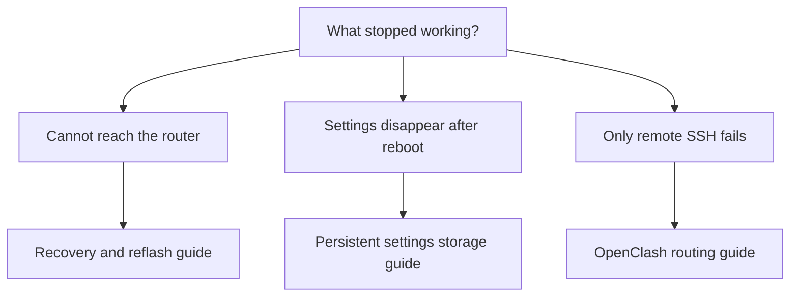

# OpenWrt notes

Practical guides for understanding and recovering an OpenWrt router. Start with the symptom that matches your problem; each guide explains what happened, how to check it, and what the recovery steps change.

## Find the right guide

| Situation | Guide |
|---|---|
| Router disappears after reboot; LAN and Wi-Fi cannot be reached | [Router unreachable after reboot](notes/troubleshooting/router-unreachable.md): diagnosis, TFTP recovery, offline repair, and reflash fallback |
| Router works, but saved settings disappear after restarting | [Settings disappear after reboot](notes/troubleshooting/config-lost-on-reboot.md): settings were kept in temporary memory |
| Remote SSH works elsewhere but fails through OpenClash | [OpenClash interrupts remote SSH](notes/troubleshooting/openclash-ssh-broken.md): understand Fake-IP and add a direct rule |
| Reinstalling software after a clean flash | [Package snapshot](backups/2026-10-08/README.md): requested package names and device metadata; not a settings backup |

## How to use these notes

Prefer browser/LuCI steps when they are available. Recovery environments may lack a web interface; unavoidable terminal steps are labeled **computer** or **router** so you can copy them into the correct place. Read the explanation and expected result before executing a command.

**Repair tries to recover existing data; formatting and clean flashing erase it.** Back up first and follow the warning next to each destructive step.

Diagrams use Mermaid, which GitHub renders automatically. Log excerpts are evidence, not commands to execute. Device-specific names appear inside guides because the storage layout and bootloader behavior matter; filenames stay short and topic-based.

## Repository scope

- `notes/troubleshooting/` contains explanations and recovery procedures.
- `backups/` contains selected non-secret reference records, currently package names and metadata.
- Private configuration archives, credentials, raw storage copies, and firmware images belong outside Git.

See [AGENTS.md](AGENTS.md) for the documentation and contribution rules.
