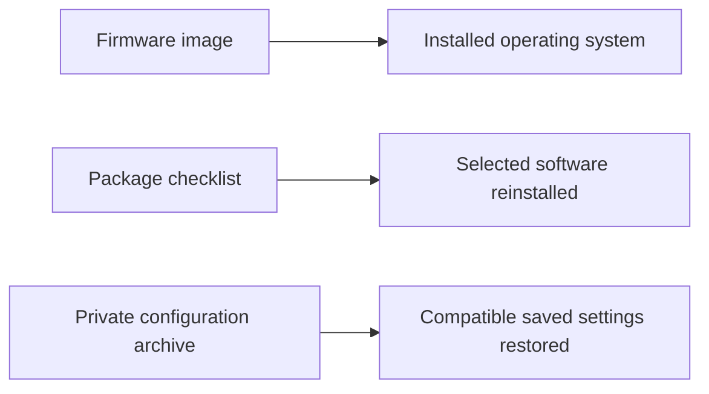

# Package snapshot

Captured after the 2026-10-08 router recovery. This folder contains **package names and device metadata only**. It does not contain a system configuration archive, Wi-Fi passwords, custom-app settings, or firmware.

| File | How to use it |
|---|---|
| [requested-packages.txt](requested-packages.txt) | Forty explicitly requested package names; use as a checklist after reinstalling OpenWrt |
| [metadata.json](metadata.json) | Firmware, kernel, hardware profile, and inventory counts for checking compatibility |

A **package** is an installable software component. Explicitly requested packages are the apps/components selected for installation. Their dependencies are additional packages installed automatically. The captured system had 198 packages in total, but this snapshot retains only the forty requested names, not a complete versioned inventory or every dependency.

**JSON**, the format of `metadata.json`, is structured text. Its firmware and kernel fields help avoid installing modules intended for another release.

## Reinstall using LuCI

1. Finish flashing and check basic LAN/WAN access using the [recovery guide](../../notes/troubleshooting/router-unreachable.md).
2. Open **System → Software** in LuCI and choose **Update lists**.
3. Use the package checklist to search for the components you still need. Compare each result with installed packages before clicking **Install**.
4. Install compatible custom apps separately if they are not available from the official feeds. Their configuration is not restored by this list.

Do not try to reinstall the `kernel` or replace base libraries merely because their names appear in the checklist. **Kernel modules** are drivers/extensions closely tied to the running kernel; their versions must match the firmware. Choose the matching image or compatible package feed instead of forcing a mismatch.

## What restores settings?

A package list restores neither passwords nor network settings. Keep a private configuration `.tar.gz` archive separately, generated through **System → Backup / Flash Firmware → Generate archive**. Restore a compatible archive through the same page's **Restore backup** section.

Review the contents of any private archive before restoring it. A normal LuCI archive can include custom-app configuration; this repository intentionally contains none.
