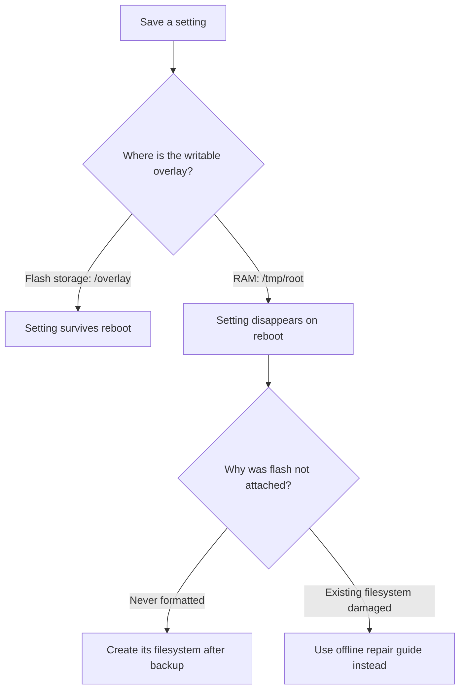

# Settings disappear after reboot

**Observed device:** CMCC RAX3000M with eMMC storage. **Firmware:** OpenWrt 25.12.5.

**Diagnosed:** 2026-07-24. **Result:** Fixed by creating the missing persistent settings filesystem.

## 1. Symptoms

The router looks newly installed after every restart: saved Wi-Fi settings vanish, added packages disappear, and a custom LAN address such as `192.168.39.1` returns to `192.168.1.1`. Settings work until the next reboot.

## 2. Why changes were lost

OpenWrt normally stores changed settings and added software in a writable **overlay**, layered over its read-only firmware. The overlay should be on flash storage so it survives a restart.

In this incident, `/dev/fitrw`, the eMMC space intended for that overlay, had never been formatted. The firmware lacked a **formatter**, the program that creates a filesystem on storage. OpenWrt instead used **tmpfs**, a filesystem held in RAM. RAM loses its contents when the system restarts, so every change disappeared.



The **filesystem** organizes files on storage. **F2FS** is the filesystem used for this device's saved settings; **eMMC** is its internal flash storage. Formatting creates a filesystem and erases the old contents. Repair tries to recover an existing one.

| Evidence in the broken state | Meaning |
|---|---|
| Root uses `overlayfs:/tmp/root` | Changes are going to RAM |
| `/dev/fitrw` starts with `de ad c0 de` | OpenWrt's unformatted marker |
| Log says `overlay filesystem ... has not been formatted yet` | Persistent storage is not initialized |
| `mkfs.f2fs` and `mkfs.ext4` absent | First-boot setup lacks a formatter |

This explanation applies to the observed incident. A temporary RAM overlay can have other causes. If an existing filesystem reports corruption, follow [router unreachable after reboot](router-unreachable.md) before formatting.

## 3. Diagnose before changing storage

### Start in the browser

Open the router's management page, usually [192.168.1.1](http://192.168.1.1/) in this broken state. **LuCI** is OpenWrt's web interface.

1. Go to **System → Backup / Flash Firmware → Generate archive**. Download settings that are still accessible before restarting.
2. Open **Status → Kernel Log** and look for `mount_root`, `overlay`, and “has not been formatted yet.”
3. Open **System → Software**, update the package list, and check whether `mkf2fs` is installed. That package provides the F2FS formatter. Installing it does not itself prove that the overlay has become persistent.

Menu names can vary by LuCI version and language. If LuCI is missing, use SSH, an encrypted command-line connection.

### Confirm the storage mapping in SSH

**Computer:**

```sh
ssh root@192.168.1.1
```

**Router:**

```sh
cat /proc/mounts
df -h
dmesg | grep -iE 'overlay|fitrw|mount_root|f2fs'
hexdump -C -n 16 /dev/fitrw
ls -l /usr/sbin/mkfs.f2fs /usr/sbin/mkfs.ext4
```

These commands inspect mounts, free space, boot messages, the beginning of the settings partition, and available formatters. They do not format storage.

Proceed only after confirming an unformatted settings area on the expected eMMC device. `/dev/fitrw` must not be mounted. If the device mapping is uncertain, use the [recovery environment](router-unreachable.md) to inspect it offline.

## 4. Create the settings filesystem

**Destructive operation:** formatting erases everything on the selected device. Preserve settings first. Do not run these commands on a mounted overlay, on a NAND variant, or merely because the management page is unavailable.

If the formatter is missing, install **mkf2fs** through **System → Software**. Without LuCI, the corresponding **router** commands are:

```sh
apk update
apk add mkf2fs
```

Then, with `/dev/fitrw` confirmed unformatted and unmounted, run on the **router**:

```sh
/usr/sbin/mkfs.f2fs -q -f -l rootfs_data /dev/fitrw
reboot
```

`mkfs.f2fs` creates the filesystem; `rootfs_data` is its label. This low-level operation has no equivalent LuCI button that safely targets only this observed partition.

The earlier procedure also recorded ext4 as a fallback filesystem using `e2fsprogs`. Do not switch formats casually; the F2FS path is the observed successful fix and should remain the documented default.

## 5. Verify and restore through LuCI

Reconnect after boot. In **Status → Kernel Log**, look for `switching to f2fs overlay`. For an exact check, run these **router** commands:

```sh
cat /proc/mounts | grep -E 'fitrw|overlay'
df -h /overlay
```

| Result | Interpretation |
|---|---|
| `/dev/fitrw` mounted at `/overlay`; root uses `overlayfs:/overlay` | Persistent settings storage is attached |
| Root uses `overlayfs:/tmp/root` | Still using RAM; investigate before configuring more |
| Read-only `/rom` shows 100% usage | Normal fixed-size firmware image, not a full settings partition |

The observed repaired overlay was about 2 GiB. Its size is device-specific; an unrelated router may differ.

Use **System → Backup / Flash Firmware → Restore backup** to restore a compatible private archive, or re-enter settings through LuCI. Change the LAN address through **Network → Interfaces → LAN → Edit** if needed; reconnect at the new address after applying.

For a persistence test, make a small recognizable change in **System → System**, such as the hostname. Save it, restart through **System → Reboot**, then check that both the change and the persistent overlay remain. Keep the original value if the change was only a test.

## 6. Prevention

When selecting/building firmware for this eMMC layout, include the appropriate formatter package rather than relying on a later RAM-only installation. After each flash, confirm the persistent overlay before spending time configuring Wi-Fi or apps.

Keep private backups outside the repository. A LuCI backup contains configuration files, not every installed app. The [package snapshot](../../backups/2026-10-08/README.md) can help identify packages to reinstall.

Do not use a factory-reset button or `mkfs` as a substitute for diagnosing a formatted but corrupt overlay. That case has a separate [repair and reflash guide](router-unreachable.md).

## References

- [OpenWrt backup and restore](https://openwrt.org/docs/guide-user/troubleshooting/backup_restore)
- [Recovery for a corrupt existing overlay](router-unreachable.md)
