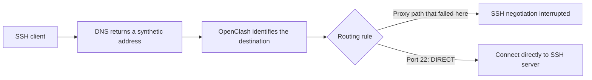
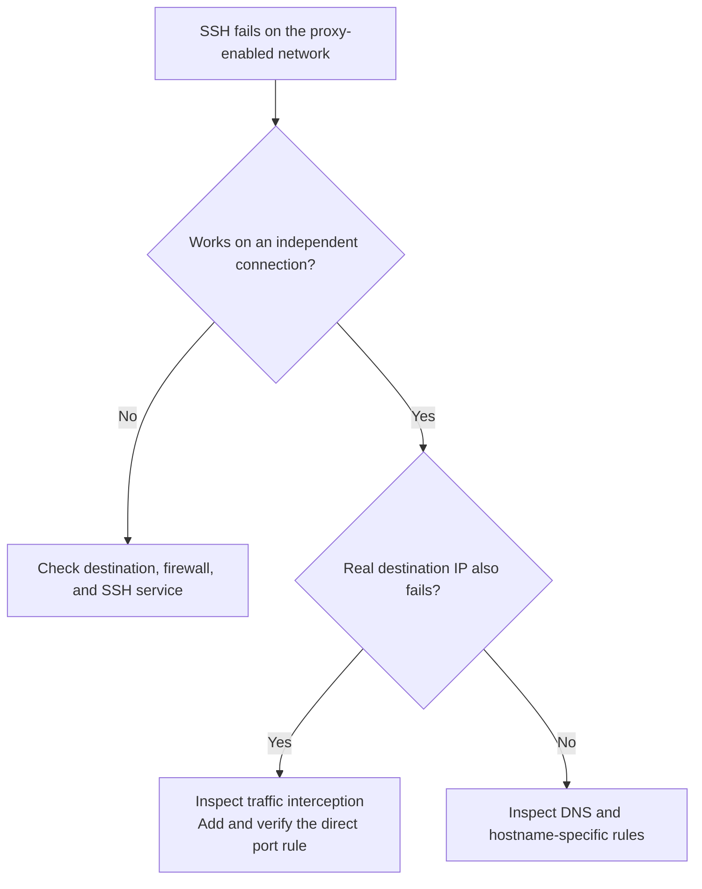

# OpenClash interrupts remote SSH

**Observed software:** OpenWrt with OpenClash using the Meta/mihomo core.

**Diagnosed:** 2026-07-25. **Result:** Remote SSH worked after destination port 22 was routed directly.

## 1. Symptoms

An SSH connection to a remote server fails while the client uses the OpenClash-enabled network, but works through an independent connection. A typical message is:

```text
Connection closed by 198.18.x.x port 22
kex_exchange_identification: Connection closed by remote host
```

**SSH** provides an encrypted remote terminal and normally uses TCP port 22. “Key exchange” is the connection's initial security negotiation. An interruption there does not by itself mean the user's login key is incorrect.

## 2. What caused the failure

**DNS** translates names such as `example.com` into addresses. In **Fake-IP mode**, OpenClash returns a synthetic address, often in `198.18.0.0/16`, and remembers the corresponding hostname. The unusual address can be expected behavior rather than an error.

A **transparent proxy** can also redirect network traffic without the client explicitly selecting a proxy. In this incident, the proxy path interrupted SSH. Even connecting to the server's real IP failed on the affected network, while an independent connection succeeded.



Changing only a hostname's DNS exception would not cover every SSH destination. The successful rule matched the **destination port**, so all ordinary port-22 SSH connections used the direct path. Direct routing bypasses the proxy, not the network firewall, and still requires the destination to be reachable.

## 3. Fix in the web interface

Open the router's LuCI management page and go to **Services → OpenClash**. Locate its custom rules or rule settings; tab names vary by OpenClash version.

1. Save a private copy of the existing custom rules.
2. Enable custom Clash rules.
3. In the **top/priority custom rules** area, add `DST-PORT,22,DIRECT` before general proxy rules. Preserve all existing rules.
4. Save/apply and restart OpenClash through its controls.

If the editor expects YAML, the rule belongs under its existing `rules:` list:

```yaml
rules:
  - DST-PORT,22,DIRECT
```

**YAML** is the structured text format used by Clash configuration. The indentation matters. Do not replace a populated rules file with only this example.

If the SSH server uses a different port, use that destination port instead. “Top” matters because the first matching rule generally determines the routing choice.

### Terminal fallback

Use this only if the relevant web editor is unavailable. On the **router**, preserve the current top custom-rules file:

```sh
cp -a /etc/openclash/custom/openclash_custom_rules.list \
  /etc/openclash/custom/openclash_custom_rules.list.backup
vi /etc/openclash/custom/openclash_custom_rules.list
```

Add the rule to the top of its existing `rules:` list, then enable custom rules and restart:

```sh
uci set openclash.config.enable_custom_clash_rules='1'
uci commit openclash
/etc/init.d/openclash restart
```

**UCI** is OpenWrt's configuration system. `uci commit` saves the setting persistently; it does not itself restart the service. The lower-priority file `openclash_custom_rules_2.list` is not the right place when an earlier rule already catches SSH.

## 4. Verify the result

Reconnect to the remote server using your usual SSH application. If OpenClash's dashboard shows connection/rule decisions, check that port-22 traffic selects **DIRECT**.

For an optional **computer terminal** test:

```sh
ssh -o ConnectTimeout=10 user@example.com 'hostname'
```

Use your actual server and username. You should see the remote hostname rather than a closed connection during negotiation. A DNS lookup may still return `198.18.x.x`; that is acceptable if SSH works through the direct rule.

In the observed incident, both hostname-based and real-IP connections succeeded, and the running rule list showed port 22 routed directly at highest priority.



## 5. Keep the fix working

After subscription/rule updates, confirm custom rules remain enabled and the direct rule still precedes catch-all proxy rules. Keep the configuration backup private because other rules or subscription files can contain credentials.

Do not disable SSH authentication or replace server keys merely because the proxy interrupted the handshake. Also, a direct rule cannot overcome an upstream network that blocks SSH entirely.

## References

- [OpenClash custom-rule examples](https://github.com/vernesong/OpenClash/blob/master/luci-app-openclash/root/etc/openclash/custom/openclash_custom_rules.list)
- [Main recovery guide](router-unreachable.md)
