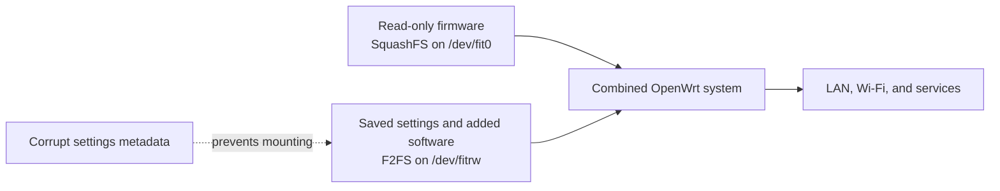
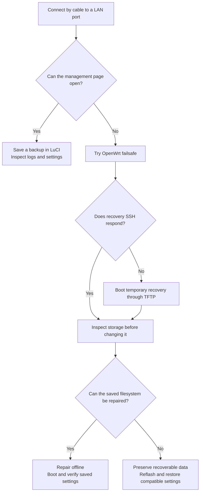
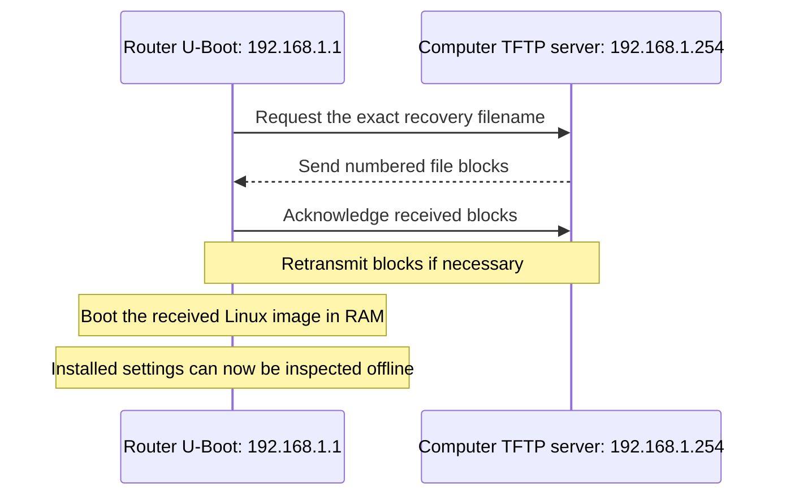

# Router unreachable after reboot

**Device:** CMCC RAX3000Me, reported by its firmware as CMCC RAX3000M because the models share an image profile.

**Observed hardware:** eMMC storage, MT7531 LAN switch. **Firmware:** OpenWrt 25.12.5, `r33051-f5dae5ece4`, kernel 6.12.94.

**Incident date:** 2026-10-08. **Result:** Original settings recovered by repairing the settings filesystem. Reflashing was not necessary.

## 1. What happened

After a reboot, all configured Wi-Fi networks disappeared. A computer connected directly to a LAN port could not reach the router at its usual address, `192.168.39.1`. The cable had a physical link, but the router did not answer local address-discovery requests or SSH connections. SSH is an encrypted connection to a device's command line.

An attempted failsafe boot produced rapid red LED flashing, but local access still failed. A flashing LED alone does not confirm that recovery networking works. A temporary recovery system transferred through the bootloader eventually provided access.

## 2. Why the router stopped working

### How OpenWrt stores settings

OpenWrt combines a mostly read-only firmware image with a writable area for settings and added software. The writable area is called the **overlay**: its files take precedence over the originals supplied by the firmware. **Mounting** means making a filesystem accessible to the running system.

On this eMMC installation, the writable area uses **F2FS**, a filesystem designed for flash storage. eMMC is the router's internal flash storage; **RAM** is temporary working memory that disappears when power is removed.



The installed firmware was readable. The settings filesystem could not mount because part of its bookkeeping was inconsistent. A filesystem's metadata records where files are stored; an **inode** is one of those file records, and an **extent** describes a run of storage blocks belonging to a file.

The kernel rejected an invalid extent in inode `0x3d2`. The filesystem checker found the same fault. After offline repair, its checks passed, the filesystem mounted, and the saved LAN and Wi-Fi settings returned. This identifies a concrete fault and strongly connects it to the loss of access.

The failed normal boot was not captured through a serial console, so the exact startup sequence that left LAN unavailable is still unknown.

### Evidence, with its meaning

| Observation | Meaning |
|---|---|
| Read-only firmware could be mounted | The base system was accessible |
| Settings filesystem reported `invalid_blkaddr corrupted_inode` | A file record referred to storage inconsistently |
| Kernel said `extent info [12800, 33, 512] is incorrect, run fsck to fix` | The filesystem needed checking and repair |
| Other main allocation and file counts agreed | The checker found a relatively localized fault |
| Repair followed by a second check passed | The detected metadata inconsistency was repaired |
| Normal boot restored LAN and Wi-Fi | Existing configuration was recoverable |

<details>
<summary>Exact diagnostic messages for comparing a future failure</summary>

```text
F2FS-fs (fitrw): Inconsistent error blkaddr:13311, sit bitmap:0
F2FS-fs (fitrw): sanity_check_extent_cache: inode (ino=3d2) extent info [12800, 33, 512] is incorrect, run fsck to fix
Info: fs errors: invalid_blkaddr corrupted_inode
Info: checkpoint state = 46 : crc compacted_summary orphan_inodes sudden-power-off
[ASSERT] (fsck_chk_inode_blk:1042) --> ino: 0x3d2 has wrong ext: [pgofs:33, blk:12800, len:512]
```

</details>

### Why did the corruption happen?

The filesystem recorded an **unclean shutdown**, meaning it was not left in its normal fully closed state. This can follow interrupted power, a crash, a watchdog reset, or a storage/filesystem fault. It does not prove that someone unplugged the router. No originating cause was established.

The eMMC lifetime estimates did not report an end-of-life warning, and the captured recovery log showed no MMC input/output error. These observations do not rule out intermittent hardware or power problems. No evidence established a particular installed app as the cause.

This differs from [settings lost on reboot](config-lost-on-reboot.md): that earlier incident had an **unformatted** settings area and kept changes only in RAM. Here, the existing filesystem was formatted but damaged. **Repair and formatting are different operations; formatting erases the old filesystem.**

## 3. Choose a recovery path

Start with the least destructive working option. Do not erase settings merely because Wi-Fi is missing.



**If the management page works:** open [the usual LAN address](http://192.168.39.1/) in a browser. **LuCI** is OpenWrt's web interface. Use **System → Backup / Flash Firmware → Generate archive** to save a private configuration backup. Check **Status → System Log** and **Status → Kernel Log**. Menu labels can vary with the installed version and language.

**If it does not:** try failsafe. This is a minimal OpenWrt boot that bypasses normal settings, usually at `192.168.1.1`, without automatic address assignment or Wi-Fi. Briefly press and release Reset during early OpenWrt boot; its timing window is short. Check SSH to confirm access. Follow the [official failsafe instructions](https://openwrt.org/docs/guide-user/troubleshooting/failsafe_and_factory_reset). Do not run a factory reset before preserving settings.

The remainder documents the TFTP route that worked on this router. Filesystem commands below apply to its **eMMC mapping**, not automatically to NAND variants.

## 4. Download the right files in a browser

1. Open the [OpenWrt Firmware Selector for this device and release](https://firmware-selector.openwrt.org/?id=cmcc_rax3000m&target=mediatek%2Ffilogic&version=25.12.5). Alternatively, search for “OpenWrt Firmware Selector,” choose **CMCC RAX3000M / CMCC RAX3000Me**, and select the intended supported release.
2. Check the model and release against the [device support page](https://openwrt.org/toh/cmcc/rax3000m). Support depends on hardware revision; the page lists all known RAX3000Me revisions as supported from 25.12.3 onward.
3. Download **SYSUPGRADE**. If the selector does not offer the recovery image, use the [official 25.12.5 download directory](https://archive.openwrt.org/releases/25.12.5/targets/mediatek/filogic/). Use the browser's Find command to locate `cmcc_rax3000m-initramfs-recovery.itb`.
4. Save both files in a folder such as `Downloads/openwrt-recovery`.

| File type | What it does | Does it reinstall the saved system? |
|---|---|---|
| `initramfs-recovery.itb` | Starts a temporary recovery system in RAM | Not by the transfer alone on the observed boot path; later commands may write storage |
| `squashfs-sysupgrade.itb` | Installs the persistent firmware through OpenWrt's upgrade process | Yes, when you confirm flashing |
| Configuration `.tar.gz` backup | Restores saved files such as LAN and Wi-Fi settings | No; it is not firmware or a package installer |

An **initramfs** is a small initial filesystem bundled with the kernel; here it lets Linux run without mounting the damaged installed settings. A **bootloader**, here U-Boot, runs before Linux and starts the chosen image. Its recovery path can work even when normal OpenWrt access fails.

### Check the download

A **SHA-256 checksum** is a file fingerprint. Compare the downloaded file's checksum with the official value to detect incomplete or different downloads. A graphical checksum utility can do this; select SHA-256 and the downloaded file. If none is available, this short command computes it without requiring any memorized download commands:

**Computer terminal, in the download folder:**

```sh
sha256sum openwrt-25.12.5-mediatek-filogic-cmcc_rax3000m-*.itb
```

| Official 25.12.5 image | SHA-256 |
|---|---|
| Recovery | `904c75334ac49ae190cf8e3d6c168e62c801d7966ac8005696cc2830ad8a8c4f` |
| Sysupgrade | `cd194d6ed64f1fa60d1315e9eafa156138c4c58b76817fb22370af26c4946b21` |

These values apply only to those official 25.12.5 images. Use the published values for another release. Stop if the values do not match.

## 5. Prepare the computer to serve the recovery file

### What is TFTP, and who sends what?

**TFTP** means *Trivial File Transfer Protocol*. It is a simple file-transfer method commonly built into bootloaders. The computer runs a **server**, which makes one folder available. The router acts as a **client**: it requests a specific filename, receives it in numbered blocks, acknowledges them, and boots the received image.

TFTP's first request uses UDP port 69. It has no login or encryption, so use it only on the directly connected recovery link and stop the server afterward. It is not an HTTP website: opening a browser at the TFTP server address will not transfer the image.



### Set the wired address through network settings

Connect the cable to a **LAN** port. In the computer's network settings, edit the wired connection's IPv4 configuration:

| Setting | Recovery value |
|---|---|
| Address method | Manual/static |
| Computer address | `192.168.1.254` |
| Netmask/prefix | `255.255.255.0` or `/24` |
| Gateway and DNS | Leave blank for this direct link |

In Linux desktops, this is usually **Settings → Network → Wired → IPv4**. In Windows, edit the Ethernet adapter's IPv4 properties. Write down the original settings so they can be restored afterward. Avoid connecting another network using the same subnet while doing recovery.

### Start a TFTP server

**Windows graphical option:** download [Tftpd64 from its project's download page](https://github.com/PJO2/tftpd64/blob/master/Readme.md), open it, choose the recovery folder as **Current Directory**, and select `192.168.1.254` under **Server interfaces**. Use only the TFTP service; this task does not need its DHCP or DNS servers. Allow it through the firewall on the recovery connection if prompted.

In your file manager, make a `tftp` subfolder and copy the recovery image into it. Rename that **copy** to exactly:

```text
openwrt-mediatek-filogic-cmcc_rax3000m-initramfs-recovery.itb
```

Choose that subfolder as the server directory. The unversioned filename is what the observed U-Boot requests. Do not rename the sysupgrade file as though it were a recovery image.

**Linux fallback:** install `dnsmasq` using your distribution's package manager if it is absent. This example uses Ethernet interface `enp5s0`; replace it with your wired interface name shown in network details. Start it on the **computer**, not the router:

```sh
sudo dnsmasq --conf-file=/dev/null --no-daemon --port=0 \
  --interface=enp5s0 --except-interface=lo --bind-interfaces \
  --enable-tftp=enp5s0 \
  --tftp-root="$HOME/Downloads/openwrt-recovery/tftp" \
  --user="$(id -un)" --log-facility=- \
  --pid-file=/tmp/openwrt-recovery-dnsmasq.pid
```

Keep the window open. This serves files without providing DNS or DHCP. If transfer fails, inspect its log and the wired firewall rules rather than disabling every firewall rule.

## 6. Start the router's TFTP recovery mode

This procedure is for the **installed OpenWrt U-Boot** on the observed router. Factory or other custom bootloaders can behave differently; check the [device recovery instructions](https://openwrt.org/toh/cmcc/rax3000m).

1. Start the TFTP server and keep the Ethernet cable in LAN.
2. Power off the router.
3. Press and hold **Reset**, then power on while holding it.
4. Release Reset after approximately **10 seconds**.
5. Wait up to about two minutes for transfer and boot. Look for a completed transfer in the server's window.

A successful transfer produced a log saying the recovery file was sent to `192.168.1.1`. That proves the file transferred; confirm that the received system actually booted before proceeding.

Try opening [192.168.1.1](http://192.168.1.1/) in a browser. A recovery image may lack LuCI, so a missing web page does not necessarily mean the boot failed. If unavailable, connect with an SSH application such as a terminal's SSH client:

**Computer:**

```sh
ssh root@192.168.1.1
```

The observed recovery system accepted a blank password. Normal firmware later required its saved password. Accept a changed SSH host key only after confirming you are connected to the intended router.

If no file request appears, check the server address, requested filename, wired link, and other LAN ports. If the file transfers but recovery stays unreachable, a **serial console** may be needed: it displays boot messages directly over hardware pins rather than the network. This board's documentation specifies 3.3 V UART, 115200 8N1. This is a hardware recovery step, not a reason to blindly flash a bootloader.

## 7. Inspect and repair the saved filesystem

LuCI does not provide this offline filesystem repair, so this part needs a command-line connection. **Run the following router commands in the recovery SSH session**, not on your computer. A raw device name is not portable across router models or storage variants.

### Confirm that you are in RAM recovery

```sh
ubus call system board
cat /proc/mounts
ls -l /dev/fit* /dev/mmcblk*
```

Look for `rootfs_type` set to `initramfs` and `/` on `tmpfs`, meaning the current root lives in RAM. Confirm the eMMC mappings before continuing. `/dev/fitrw` must **not** be mounted as the live `/overlay` when checking or repairing it.

### Save evidence and a copy before repair

**Computer terminal:**

```sh
mkdir -p "$HOME/Downloads/openwrt-recovery/evidence"
cd "$HOME/Downloads/openwrt-recovery/evidence"
ssh root@192.168.1.1 'dmesg; logread; fw_printenv' > recovery.txt
ssh root@192.168.1.1 'dd if=/dev/fitrw bs=1048576 | gzip -1' > overlay-before-repair.img.gz
gzip -t overlay-before-repair.img.gz
```

`dd` copies the raw settings partition; `gzip` compresses it. Wait for the copy to finish successfully. Keep it private because it can contain passwords and keys. The observed copy covered 2,136,371,200 bytes, about 2 GiB. For another installation, read `/sys/class/block/fitrw/size` on the router and multiply the sector count by 512; verify that the decompressed copy has that size. `gzip -t` checks compression integrity, not whether every sector was copied.

### Confirm the fault without modifying the filesystem

**Router:**

```sh
mkdir -p /mnt/production /mnt/saved-overlay
mount -t squashfs -o ro /dev/fit0 /mnt/production
cat /mnt/production/etc/openwrt_release
mount -t f2fs -o ro,norecovery /dev/fitrw /mnt/saved-overlay
dmesg | tail -60
```

`ro,norecovery` requests a read-only mount without replaying unfinished filesystem recovery. In this incident it failed with the metadata errors shown earlier. If it succeeds, **unmount it before running the checker**:

```sh
umount /mnt/saved-overlay
```

**Router, settings filesystem unmounted:**

```sh
/usr/sbin/fsck.f2fs --dry-run -f /dev/fitrw
```

**fsck** means filesystem check. `--dry-run` inspects/proposes changes without applying the repair. This option was supported by the observed tool. If the checker is missing, use a compatible recovery environment that contains it, or install the compatible `f2fsck` package into RAM recovery if connectivity is available. Do not format just because a repair tool is missing.

### Apply and verify the repair

**This changes filesystem metadata and can discard irreparable data. Proceed only after preserving the copy.**

**Router:**

```sh
/usr/sbin/fsck.f2fs -f -y /dev/fitrw
/usr/sbin/fsck.f2fs --dry-run -f /dev/fitrw
mount -t f2fs -o ro,norecovery /dev/fitrw /mnt/saved-overlay
cat /mnt/saved-overlay/upper/etc/config/network
```

The second check must have no failed checks, the mount must succeed, and saved settings should be readable. If repair fails, continue to the reflash fallback rather than repeatedly forcing it.

To preserve recovered files, this **computer** command saves an additional archive:

```sh
ssh root@192.168.1.1 'tar -czf - -C /mnt/saved-overlay upper/etc' > recovered-settings.tar.gz
```

That archive starts with `upper/etc`, unlike a standard settings backup. Do not upload it directly as a LuCI restore archive; inspect it separately.

### Boot normally

**Router:**

```sh
umount /mnt/saved-overlay
umount /mnt/production
sync
reboot
```

In the computer's wired network settings, restore automatic addressing (DHCP). Allow the router to boot, then open [192.168.39.1](http://192.168.39.1/) and sign in with the original credentials. If DHCP is unavailable, temporarily use `192.168.39.2/24` to reach the saved LAN address.

## 8. Verify recovery in the web interface

- **Status → Overview:** check the expected firmware and available storage. A read-only firmware area showing 100% usage is normal; its size is fixed.
- **Network → Interfaces:** verify LAN and WAN are up, with the expected LAN address and an upstream connection.
- **Network → Wireless:** confirm both radios and the intended access points are enabled.
- **Status → Kernel Log:** search for new `F2FS`, `fitrw`, or storage errors.
- Connect a client to Wi-Fi, open the management page, and test internet access separately.

The original repair passed the second filesystem check and restored all three Wi-Fi networks. The owner confirmed wireless access. A subsequent normal-boot audit confirmed `/dev/fitrw` mounted at `/overlay`, valid active UCI settings, working DNS/firewall checks, and WAN connectivity. It also restored missing HTTPS certificate files; both HTTP and HTTPS then responded. This was not a repeated-reboot endurance test.

**Advanced mount check, on the router:**

```sh
cat /proc/mounts | grep -E 'fitrw|overlay'
```

Expect the writable root to use `/overlay`, not the temporary RAM fallback `/tmp/root`.

## 9. Reflash if repair cannot recover the installation

**Reflashing was not performed in this incident. The procedure below is a fallback. It replaces installed firmware and, for a clean install, removes saved settings and added packages.** Preserve recoverable data first and keep power stable throughout.


### Prefer LuCI when it is available

If the installed or recovery system offers LuCI:

1. Open its management page and go to **System → Backup / Flash Firmware**.
2. Under **Flash new firmware image**, choose the downloaded **sysupgrade** image.
3. Check the device compatibility and checksum shown before confirmation.
4. For this clean recovery, clear **Keep settings and retain the current configuration**. This intentionally discards old settings; have your private backup ready.
5. Confirm flashing and wait. Do not disconnect power or interpret the temporary loss of the web page as a failed upgrade.

The recovery image may omit LuCI. In that case use the terminal fallback below. Do not try to install a web interface onto a damaged live overlay just to avoid recovery SSH.

### Terminal fallback for RAM recovery

A graphical SFTP client can upload the verified sysupgrade image to `/tmp/sysupgrade.itb` **if** that recovery image provides SFTP. Otherwise use this legacy SCP command on the **computer**:

```sh
scp -O "$HOME/Downloads/openwrt-recovery/openwrt-25.12.5-mediatek-filogic-cmcc_rax3000m-squashfs-sysupgrade.itb" root@192.168.1.1:/tmp/sysupgrade.itb
```

Before upgrading, unmount any manually mounted production/settings filesystems. On the **router**, validate before writing:

```sh
sha256sum /tmp/sysupgrade.itb
sysupgrade -T /tmp/sysupgrade.itb
```

`-T` tests image compatibility. Stop on a mismatch; do not bypass an unexplained failure with `-F`. After successful checks, the following **destructive** command installs cleanly:

```sh
sysupgrade -n /tmp/sysupgrade.itb
```

`-n` means do not retain configuration. SSH disconnection is expected. Once boot completes, return the computer to automatic wired addressing and open [192.168.1.1](http://192.168.1.1/). Wi-Fi is normally disabled until configured.

### Restore settings through LuCI

Before configuring extensively, check that the overlay is persistent. If settings storage is unformatted and changes only survive in RAM, follow the [separate unformatted-overlay guide](config-lost-on-reboot.md).

In **System → Backup / Flash Firmware → Restore backup**, choose a compatible private `.tar.gz` configuration backup, such as the previously saved `OpenWrt-RAX3000M-Necessities.tar.gz`. Review its origin and contents before confirming; it can restore passwords and network addresses. Restart as prompted, or use **System → Reboot** after the restore.

The saved LAN address may return to `192.168.39.1`. Reconnect there. Reinstall added packages separately through **System → Software** where available. A configuration backup is not an app installer. Across incompatible firmware versions, migrate selected settings manually instead of restoring every old file.

The [repository snapshot](../../backups/2026-10-08/README.md) contains package names and metadata only. It is **not** the private settings archive needed for this restore.

## 10. Prevent recurrence and finish cleanup

Use **System → Reboot** for normal restarts and allow it to finish. Keep private backups and verified recovery files off-router. After a future planned reboot, confirm the settings still persist.

If corruption recurs, collect normal failed-boot output and any crash records before wiping or reflashing. Repeated corruption merits investigation of power, storage, and software stability; another reflash alone does not identify the cause.

Stop the temporary TFTP server using its application's controls, or Ctrl+C in its terminal. In the computer's network settings, remove the temporary recovery profile and restore the original DHCP settings. Remove any temporary diagnostic SSH key. Keep genuine physical interfaces and unrelated applications intact.

## References

- [Device support and bootloader recovery](https://openwrt.org/toh/cmcc/rax3000m)
- [Firmware Selector](https://firmware-selector.openwrt.org/)
- [Official 25.12.5 images and checksums](https://archive.openwrt.org/releases/25.12.5/targets/mediatek/filogic/)
- [TFTP recovery explained by OpenWrt](https://openwrt.org/docs/guide-user/troubleshooting/tftpserver)
- [Failsafe instructions](https://openwrt.org/docs/guide-user/troubleshooting/failsafe_and_factory_reset)
- [LuCI flashing procedure](https://openwrt.org/docs/guide-quick-start/sysupgrade.luci)
- [Configuration backup and restore](https://openwrt.org/docs/guide-user/troubleshooting/backup_restore)
